# 寻龙工作台

> **一个可解释、可回测、可校准的 A 股研究系统。**
>
> 它不做「AI 选股神器」那一套。每一分评分都能点开看依据，每一次降级都会标出来源，
> 每一条推送都留了审计记录——**你可以不同意它的结论，但你能查到它是怎么得出的。**


---

## 为什么做这个

市面上的选股工具大多绕不开两个毛病。

**一是黑箱。** 给你一个「综合评分 85 分，强烈推荐」，但你问不出这 85 分怎么来的。隔天再跑，数字变了，原因不明。

**二是假装数据永远在线。** 主数据源挂了就静默降级到别的源，日期对不上也不说，用户拿着上周的快照当今天的行情做决策。

寻龙工作台的出发点就两句话：**让每一分评分可追溯，让每一次降级可见。**

- 评分 → 拆成 MA5 / KDJ / MACD / MA10 四项证据卡片，写明判定条件与扣分理由，盖上规则库版本号
- 行情 → 每条数据带**来源、交易日、时间、有效状态**四个字段，旧日期快照不会冒充当日竞价
- 决策 → 数据快照、评分拆解、闸门结果、策略版本、最终结论全部落 SQLite，事后可复盘当时到底看到了什么

---

# 板块简介

工作台一共 **13 个功能视图 + 1 个独立页面**，下面逐块说明。

## 1 · 总览

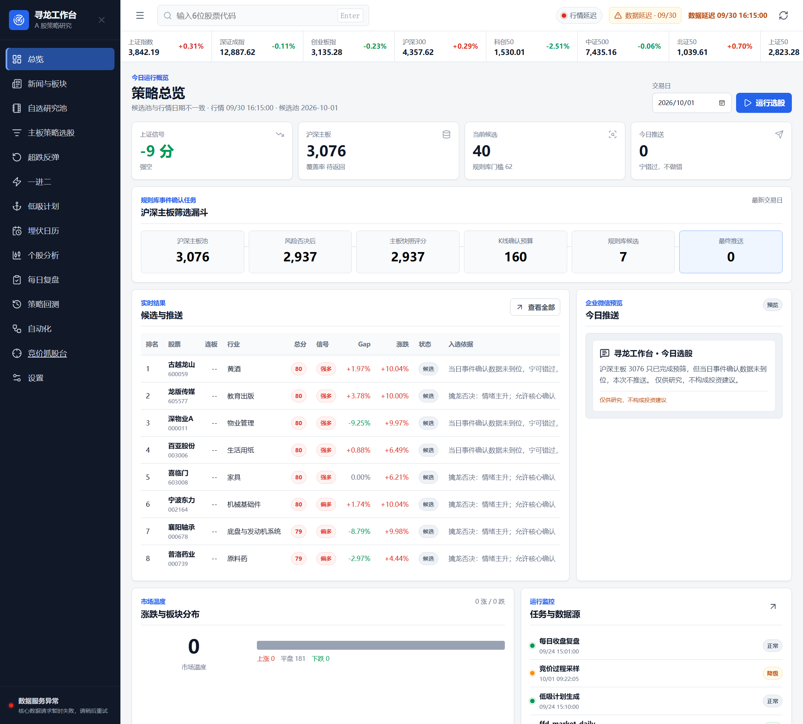

一屏看完当日全局。

顶部是七大指数实时看板；中间「今日运行概览」给出四个关键数字：上证信号分、沪深主板池、当前候选、今日推送。下方**沪深主板选股漏斗**把 3076 → 2937 → 160 → 7 每一步的淘汰原因摊开——风险过滤砍掉多少、K 线确认预算用在哪、规则库筛完剩几只，一眼看到瓶颈在哪。

再往下是候选与推送明细表（含每条「入选依据」和**未推送原因**）、今日推送预览（企业微信消息实际长什么样）、板块涨跌分布，右下角「任务与数据源」实时显示每个定时任务最后一次运行状态与各数据源健康度。

## 2 · 新闻与板块

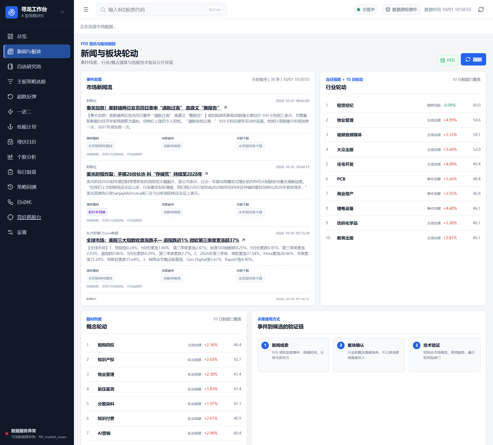

情绪面的输入层，三条线并列：

- **市场新闻流水**（左）——多源财经快讯，每条标注来源与时间，支持按关键词过滤
- **行业轮动 / 概念轮动**（右上、右下）——按 10 日驱动值排序的板块榜，给出板块涨幅与驱动分
- **事件驱动的验证链**（下）——新闻面 → 板块确认 → 技术确认，说明一条消息要变成可交易信号必须过哪三关

顶部有「同步 FFD」按钮用于手动拉取最新数据。

## 3 · 自选研究池

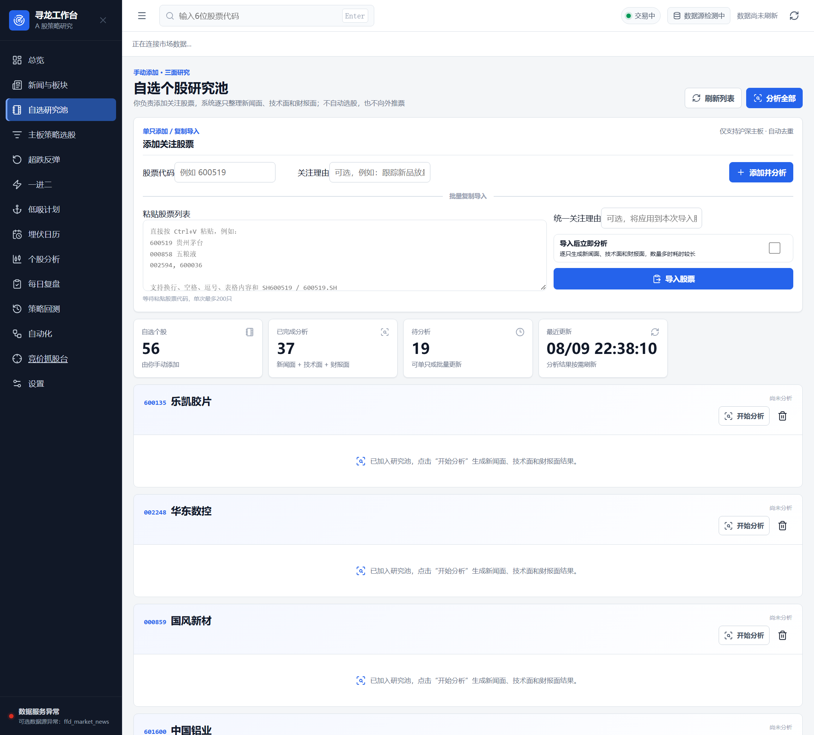

手动维护的观察池。**这是研究工具里唯一由你决定标的的地方**——系统不会自动往这里塞股票。

支持单只添加，也支持从表格、微信或网页复制一段文本后粘贴批量导入：自动提取 6 位代码、去重、过滤非沪深主板，并统一挂上关注理由。顶部四个计数显示自选个数、已简版分析数、已评分、最近更新。每只票一张卡片，可以单只「分析」或一次性「分析全部」，生成新闻面 / 技术面 / 财报面三份分析。

## 4 · 主板策略选股

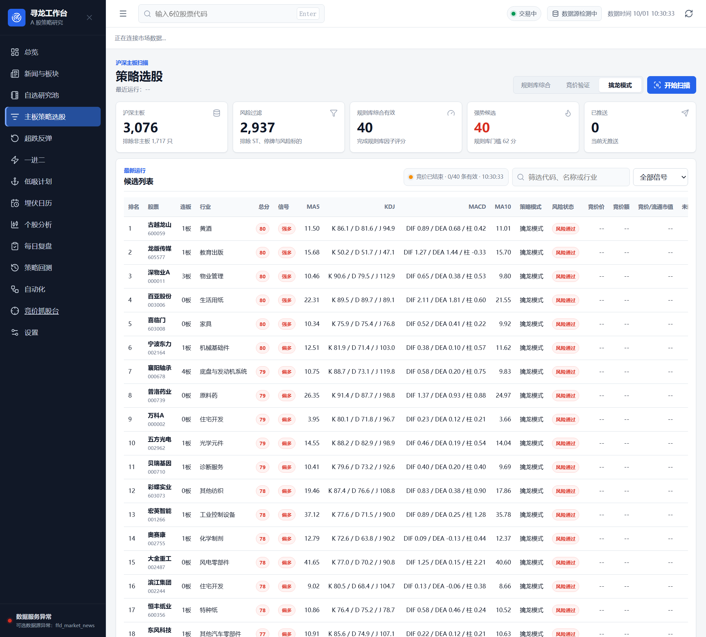

全市场扫描的主页面。可切换「规则库综合 / 竞价验证 / 擒龙模式」三种口径。

顶部漏斗展示扫描链路：沪深主板 3076 → 风险过滤 2937（排除 ST、停牌与风险标的）→ 规则库综合有效 40 → 擒龙候选 40 → 已推送 0。

候选表逐行给出评分、信号强度、**MA5 / KDJ / MACD / MA10 各维度的具体数值**、命中策略模式、风险状态，以及最右侧的「入选依据」——写清楚为什么推它，或者为什么不推它。

## 5 · 超跌反弹

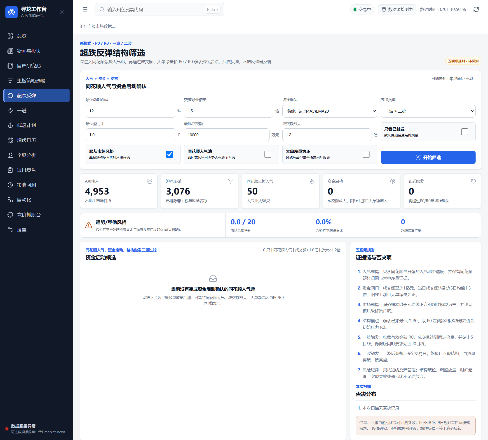

人气 + 资金 + 趋势**三重确认**的结构精选，不是无脑抄底。

参数区全部可调：最低成交额、成交额量比、趋势确认档位（一浪 / 二浪）、最低大单净额、成交额倍数、扫描上限；三个开关决定是否服从市场选择、是否只用同花顺人气池、是否要求大单净量为正。

下方漏斗展示：人气输入 → 沪深主板 → 同花顺主板人气 → 资金启动 → 正式触发。

右侧「五维解读 / 证据链与筛选值」把 7 条判定规则逐条摊开（人气池 → 资金确认 → 市场趋势 → 锁点定位 → 一浪确认 → 二浪确认 → 风险校验），再往下是「否决分布」，说明候选都死在哪一关。**空仓也是一种结论**——没有票满足条件时，页面会直接告诉你原因。

## 6 · 一进二

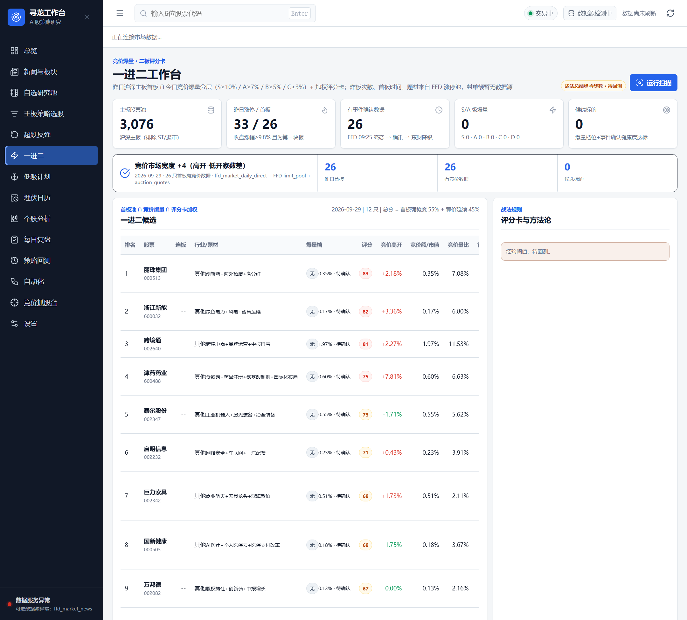

昨日首板 → 今日二板的评分卡筛选。

顶部三个体温计：主板票池 3076、昨日首板/断板 33 / 26、有竞价序列数据的 26 只；以及竞价市场温度、S/A 档晋级值、竞价转强数三个市场指标。

候选表给出评分、题材板、竞价高开幅度、换手比、量比、聪明比率、昨日封板情况、流通市值、竞价分与风险阈值。右侧「评分卡与方法论」说明 10 分制评分阈值（溢价率 ≥ 7% / 5% / 3% / 2%）的来路。

## 7 · 低吸计划（素衣模式）

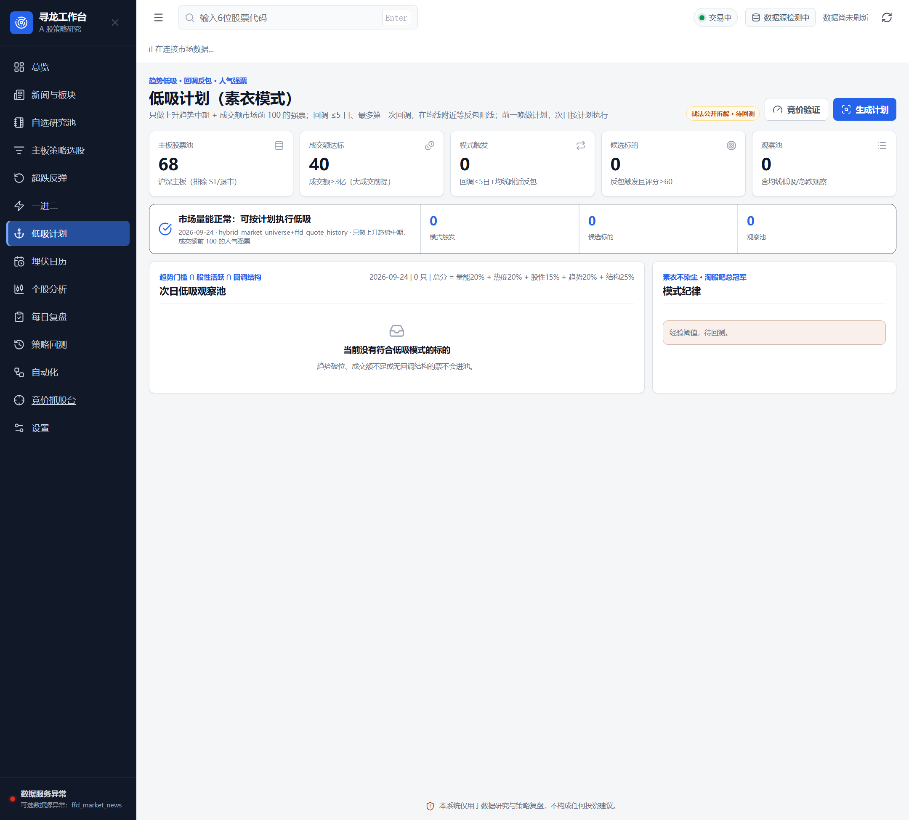

盘后生成**次日**的低吸观察计划。

核心口径：只做上升趋势 + 成交额前 100 的强势股，要求缩量 ≤ 5 日、最多三次回踩，在均线附近企稳后出现反包机会才纳入。

参数区可调主板池、成交额达标数、缩量候选、企稳候选、低吸窗口。下方是次日低吸观察池，同样标注筛选值与淘汰原因。右侧「模式本质与适用边界 / 模式纪律」说明这套打法的适用前提。

## 8 · 埋伏日历

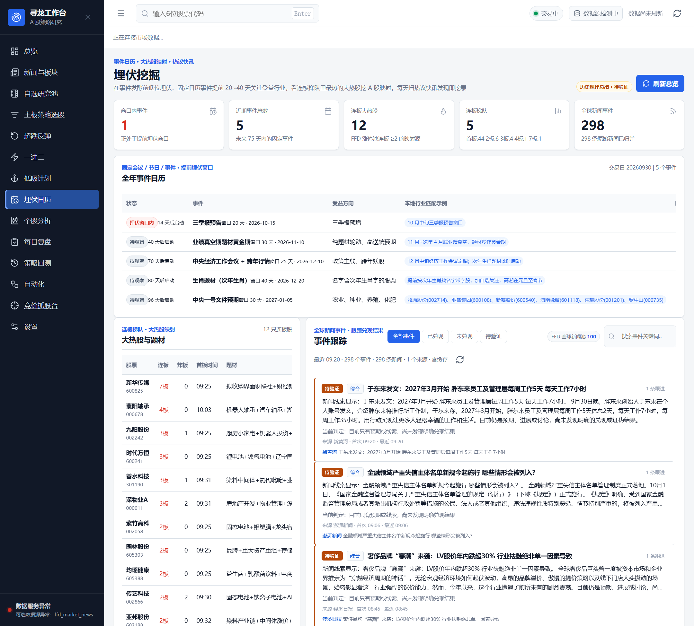

事件驱动的左侧打法：**在事件发生前 20–40 天关注正股**。

四条并列：

- **全年事件日历**——列出「三季报预告」「中央经济工作会议」等已知事件的时间窗口、涉及方向、本地标的映射与股数
- **大热股与题材**——30 只热门股及其题材标签、今日涨幅与驱动分，用来做事件到大热股再到 A 股标的的映射
- **事件追踪**——重点事件的快讯流，按时间倒序

上方计数显示正盯事件数、近期事件相关股数、当前下单数、快照期数与全域快照数。

## 9 · 个股分析

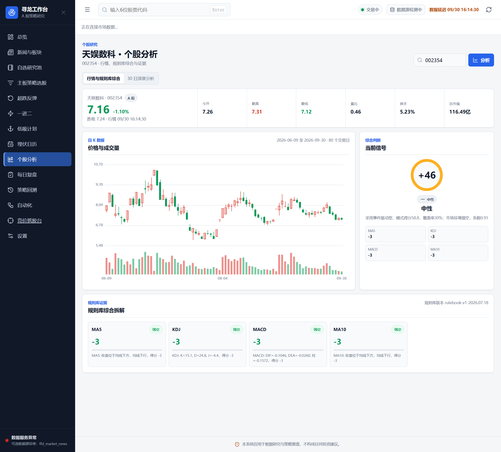

单只标的的完整研究页，也是整个系统「可解释」的样板。

左侧 K 线量价（含成交量柱），右上给出综合信号与总分；**下方把总分拆成完整来路**：

| 维度 | 判定条件 | 得分 |
|---|---|---|
| MA5 | 收盘位于均线下方，均线下行 | −3 |
| KDJ | K=15.1, D=24.8, J=−4.4 | −3 |
| MACD | DIF=−0.1046, DEA=−0.0260, 柱=−0.1572 | −3 |
| MA10 | 收盘位于均线下方，均线下行 | −3 |

标题栏固定显示当前**规则库版本号**（如 `rulebook-v1-2026.07.18`）。参数一改版本号跟着变，历史记录能对齐到当时那套参数。

## 10 · 每日复盘

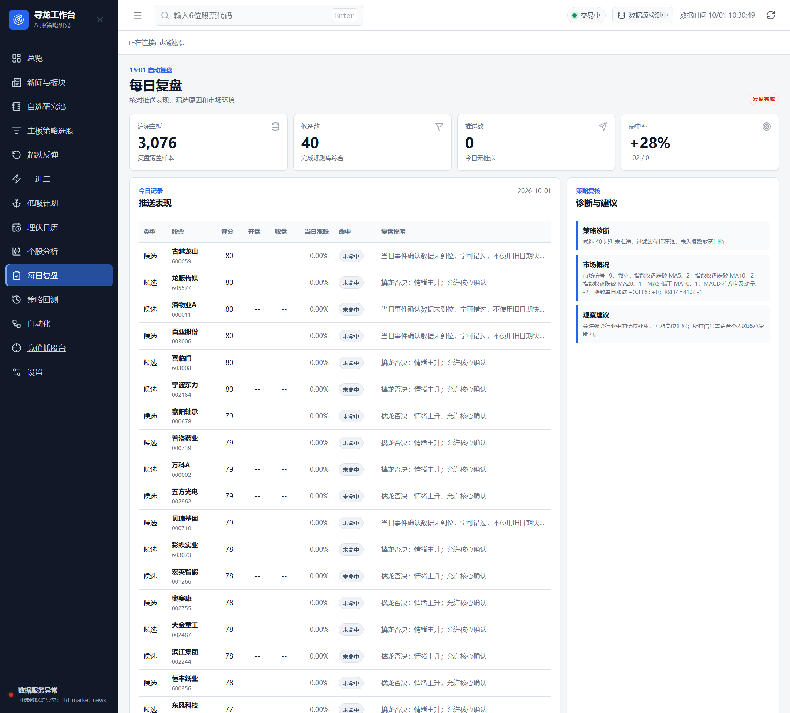

15:01 自动生成，核对「昨天说了什么、今天兑现没有」。

四个指标打头：沪深主板复盘覆盖样本、候选数、推送数、**命中率**。下方「推送表现」逐条列出当日候选与推送结果、是否命中、以及复盘说明（明确区分「事件确认数据未到位，宁可错过」和「擒龙否决：情绪主升，允许核心确认」这类原因）。

右侧「诊断与建议」分策略诊断、市场情况、观察建议三块。命中仅统计**实际推送记录**，校准样例不会伪装成实时业绩。

## 11 · 策略回测

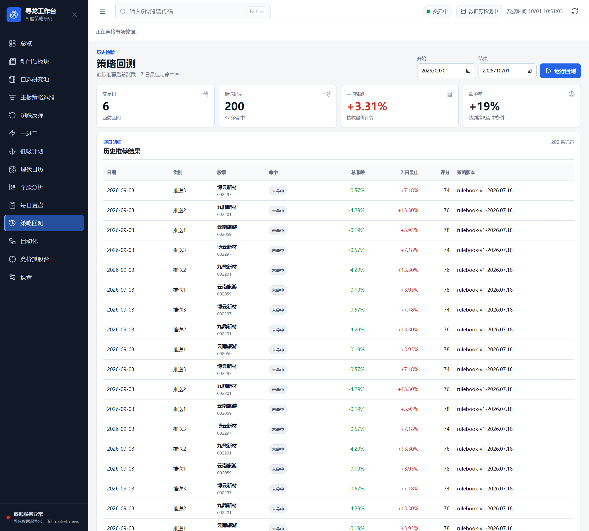

选时间区间跑历史回测。指标：交易日数、推送记录数、平均涨跌、命中率。

「历史推荐结果」逐条列出日期、推送档位、股票、是否命中、总涨跌、**7 日最佳涨幅**、评分，以及**当时使用的策略版本**——这一列是审计的关键，换过参数的历史记录不会被新参数污染。

## 12 · 自动化

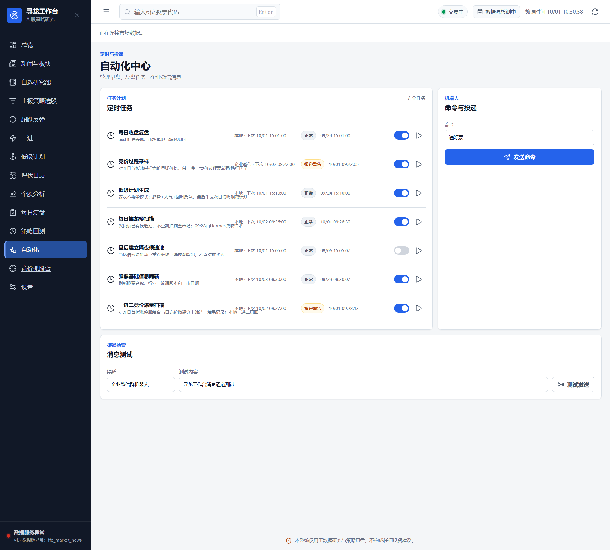

7 个定时任务的开关与运行状态，每个显示上次运行时间与结果（正常 / 投递警告）：

| 时间 | 任务 |
|---|---|
| 交易日 09:26 | 每日擒龙预扫描（仅用当日 09:20–09:29 实时行情与竞价） |
| 交易日 09:27 | 一进二竞价爆量扫描 |
| 交易日 15:01 | 每日收盘复盘 |
| 交易日 15:05 | 盘后建立隔夜候选池 |
| 每日 08:30 | 股票基础信息刷新 |
| 每日 15:10 | 低吸计划生成 |
| 交易日 09:22 | 竞价过程采样 |

右侧是机器人命令面板，可选 `选好票` 等命令直接投递给企业微信；下方是渠道消息测试，用来验证推送链路是否通畅。

## 13 · 设置

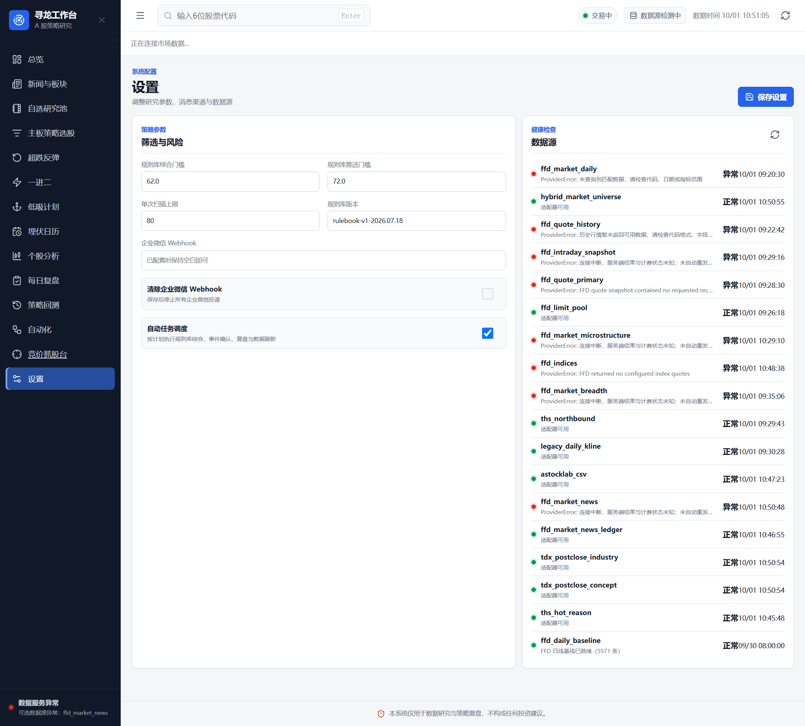

策略参数（技术筛选门槛、竞价推送门槛、单次扫描上限、策略版本号）、企业微信 Webhook 配置与一键清除、以及数据源相关选项。所有密钥只存在本机 SQLite，不上传任何服务器。

## 14 · 竞价抓股台（独立页面）

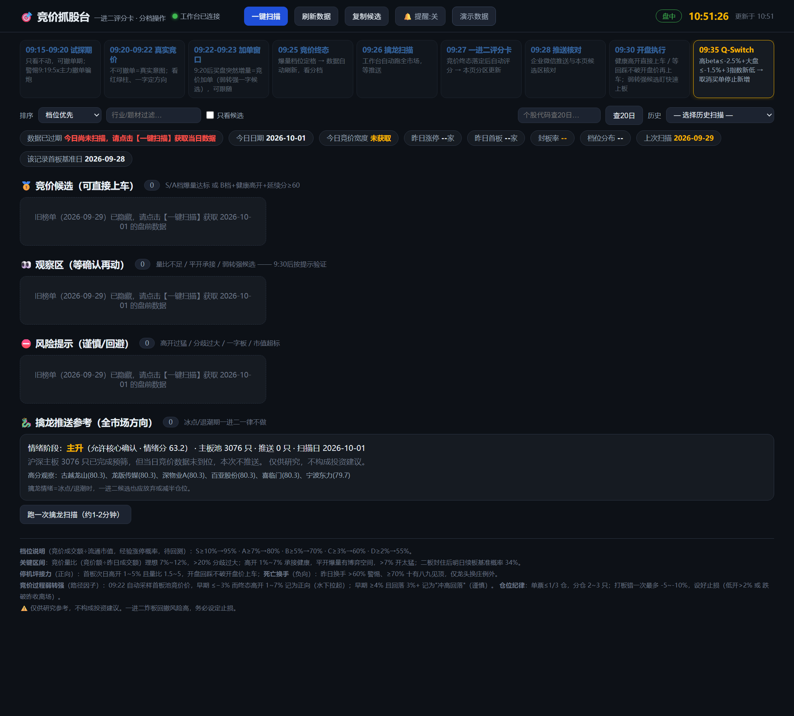

独立页面，从侧边栏新标签打开。围绕 **09:15–09:35 竞价窗口**的作战面板。

顶部时间轴把九个时间点该做什么列清楚：09:15-09:20 试撮期（只看不动）、09:20-09:22 真实竞价、09:22-09:23 加塞窗口、09:25 竞价终态、09:26 擒龙扫描、09:27 一进二评分卡、09:28 推送核对、09:30 开盘执行、09:35 Q-Switch。

主体分四区：**竞价候选**（可直接上车）、**观察区**（等确认再动）、**风险提示**（谨慎 / 回避）、**擒龙推送参考**（全市场方向，含情绪阶段、主线池、高分离群点）。

底部附档位说明、关键时刻表、竞价量比阶梯、竞价强转偏弱等口径表，以及本策略的使用纪律（单票仓位、分仓方式、止损止盈）。

---

# 技术说明

## 数据源：分层取数 + 显式降级

```
FFD 全市场增强日线 ── 股票池、行情、量比、换手率、流通市值、均线
FFD 批量行情       ── 个股/指数实时快照、批量历史 K 线、市场宽度
FFD 专项数据       ── 09:25 竞价终态、涨停池、新闻、公告、财务指标
        ↓ 仅当精确交易日或字段不可用时，才启用带来源标记的兼容回退
本地通达信 → 腾讯 / 新浪 / 东方财富 / 巨潮
        ↓
TTL 缓存 + 提供者限流 + SQLite 审计
```

三条纪律：

1. **批量优先，不逐股调用。** 候选池历史 K 线走一次批量请求，不拆成 N 次逐股拉取。
2. **页面显示行情源时间，不是请求时间。** 行情日期与候选池日期不一致时，顶部明确提示。
3. **竞价数据分三层。** 09:25 终态优先 FFD `call_auction`；09:15–09:25 盘中优先腾讯虚拟撮合价；两者都不可用时才用东方财富公开快照。每条结果保留来源、交易日、时间和有效状态。

全市场快照不可用时，还可读取 `XUNLONG_UNIVERSE_FILE` 指向的本地 HTML 代码目录做降级覆盖——但结果会被**明确标记为降级**，价格与财务因子必须重新核验，科创板和风险排除照常执行。

## 三套主打打法

**超跌反弹 · 资金启动版 P0/R0** — 默认要求同时满足：成交额 ≥ 1 亿元、成交额达到近 5 日均值的 1.5 倍、阳线上涨、大单净量为正。在此基础上识别已知低点 **P0**、左侧第 2 根 K 线压力 **R0**、约 2 倍量突破与均线确认。二波行情进一步要求 **3–9 日缩量回踩后再放量突破一波高点**。

**擒龙模式** — 量化初筛之后依次过六道判断：情绪周期 → 主线板块 → 板块强度 → 龙头地位 → 抗跌/超预期 → 弱转强 / 首次分歧 / 回流买点。冰点、退潮、中位负反馈或数据缺失时**禁止推送**。

**一进二** — 对昨日首板涨停股结合当日竞价做评分卡筛选，分档结果与实战复盘记录全部留痕。

### 统一的排除规则

所有策略选股统一只做**沪深主板**（`000` / `001` / `002` / `003` / `600` / `601` / `603` / `605`）。创业板、科创板、北交所、ST、退市整理、停牌、严重缺失和流动性不足，一律不入选。

## 七套经典策略检测器

并列运行、独立留痕，可单独查看触发情况：

| 策略 | 说明 |
|---|---|
| 放量上涨 | 量能显著放大且价格上涨 |
| 均线多头 | 多周期均线呈多头排列 |
| 停机坪 | 高位横盘整理形态 |
| 突破平台 | 突破前期整理平台 |
| 海龟交易 | 唐奇安通道突破（默认 60 日） |
| 回踩年线 | 回踩 MA250 后获得支撑 |
| 无大幅回撤 | 近期走势平稳、回撤可控 |

## QMT 本地行情桥接

QMT 客户端登录运行时，股票池 / 实时快照 / 竞价核验 / 日 K 优先走本地 QMT（交易所直连，无调用次数限制）；客户端离线时自动落回 FFD → 腾讯链路。**只读行情，不接交易接口**（`xttrader` 不在桥接范围内）。

任何故障（库缺失、客户端离线、调用超时）都由上层 provider 自动降级，调用方不需要写 QMT 特有的错误处理。

QMT 安装目录因券商而异，因此**代码里不内置任何券商的默认路径**。探测顺序：`XUNLONG_QMT_PATH` → `XUNLONG_QMT_DIRS` → 按盘符通配 `*QMT*`。

## 快速开始

```bash
git clone https://github.com/Hu-ge1/xunlong-workbench.git
cd xunlong-workbench
pip install -r requirements.txt
python server.py
```

浏览器打开 <http://127.0.0.1:8765>

Windows 也可以双击仓库根目录的 **`启动寻龙工作台.cmd`**：它会先在后台拉起服务，用 `/api/health` 核验应用身份，再用 Edge 应用模式打开工作台，避免被已有浏览器会话吞掉。

> 服务默认只监听 `127.0.0.1`，仅本机可访问。

健康状态分「正常 / 降级 / 异常」三档。**降级**表示工作台仍可用，但部分主数据源不可用并已启用明确标记的后备来源——例如 FFD 日线未就绪时回退到本地通达信。

## 配置

复制 `.env.example` 为 `.env` 后按需填写。**所有变量都是可选的**：不配置也能启动，只是对应的本地数据源会被标记为「未配置 / 降级」。

| 变量 | 用途 |
|---|---|
| `XUNLONG_QMT_PATH` / `XUNLONG_QMT_DIRS` | QMT 客户端与 xtquant 库位置（留空则按盘符通配 `*QMT*` 自动探测） |
| `GUPIAO_TDX_VIPDOC` | 本地通达信日线目录，默认 `C:/new_tdx/vipdoc` |
| `OBSIDIAN_VAULT_PATH` | Obsidian 库根目录（复盘报告与策略规则读写），默认 `%USERPROFILE%\Documents\Obsidian Vault` |
| `ASTOCKLAB_ROOT` | 可选的 AStockLab 本地缓存仓库 |
| `XUNLONG_UNIVERSE_FILE` | 可选的离线代码目录（HTML），仅作降级覆盖 |
| `XUNLONG_DATA_DIR` | 迁移 SQLite 数据库与缓存目录 |
| `XUNLONG_BASE_URL` | `mcp_server.py` 连接本机服务的地址，默认 `http://127.0.0.1:8765` |
| `XUNLONG_PYTHON` | 启动脚本使用的 Python 解释器，默认自动发现 |
| `FFD_MCP_TIMEOUT` / `FFD_MCP_BULK_TIMEOUT` | 交互请求 / 批量请求超时（秒） |

## 项目结构

```
server.py                  # 本地开发入口（加载 .env → 启动 uvicorn）
mcp_server.py              # MCP 服务，把工作台能力暴露给外部智能体
启动寻龙工作台.cmd          # Windows 一键启动
run.ps1                    # 启动器：发现 Python + 依赖自检 + 拉起服务
launch_desktop.ps1         # 健康探测 + Edge 应用模式打开
app/
  main.py                  # FastAPI 入口与全部 API 路由
  services.py              # 业务编排：扫描、候选、闸门、推送、复盘（最大模块）
  providers.py             # 数据源适配层：FFD / 通达信 / 腾讯 / 新浪 / 东财 / 巨潮 ★
  qmt.py                   # QMT(xtquant) 只读行情桥接，故障自动降级 ★
  scoring.py               # 确定性指标与规则库评分 ★
  strategies.py            # 7 套经典策略检测器
  oversold.py              # 超跌反弹 P0/R0 筛选
  dixi.py                  # 低吸模式（趋势 + 人气 + 回调反包）
  maifu.py                 # 埋伏挖掘（事件日历 + 大热股映射）
  yijiner.py               # 一进二评分卡
  patterns.py              # K 线形态识别
  news_feed.py             # 多源财经快讯抓取与合并
  review.py                # 短线复盘七步框架
  scheduler.py             # 定时任务编排
  storage.py               # SQLite 持久层（快照 / 评分 / 闸门 / 决策审计）
  obsidian_config.py       # 从 Obsidian 库同步策略规则
  static/                  # 前端：原生 JS + CSS，无构建步骤
tests/                     # 110 个测试函数
docs/screenshots/          # README 截图
```

## 测试

```bash
python -m unittest discover -s tests -v
```

测试使用假数据源时会自动禁用海外指数、ETF 和基金持仓等外部补充请求，避免消耗行情额度或因限流卡住。

## 口径说明

- **红色表示上涨、绿色表示下跌**，符合 A 股界面习惯
- 回测总涨跌：`(当日收盘 − 当日开盘) / 当日开盘 × 100%`
- 命中仅统计**实际推送记录**，校准样例不会伪装成实时业绩
- 7 日最佳以推荐日开盘为基准，取随后最多 7 个交易日的最高价
- 经验阈值统一标注为「待回测」，不冒充实测结论

## 它不做什么

放在这里免得误会：

- ❌ **不自动选股、不对外推票。** 所有候选都需要你自己确认
- ❌ **不接交易接口。** 只读行情，不会替你下单
- ❌ **不掩盖数据问题。** 数据缺失就标缺失，降级就标降级，宁可不推
- ❌ **不声称还原了某个未公开产品的源码或隐藏参数。** 第一版参数全部可配置

## 路线图

- [ ] 打包为 Windows 免安装版本（内置 Python 运行时）
- [ ] 策略参数的可视化回测校准面板
- [ ] 更多数据源适配器（降低对单一主源的依赖）
- [ ] 推送渠道扩展（钉钉 / 飞书 / Server 酱）

## 参与贡献

欢迎 Issue 和 PR。提交前请确认：

1. 搜一下现有 issue，避免重复
2. **删掉敏感信息**——券商名称、资金账号、Webhook Token、含用户名的本机绝对路径。这些一旦进入提交历史，清理成本远高于提交前检查
3. 跑一遍测试：`python -m unittest discover -s tests -v`

提功能建议时请先讲**场景和痛点**，再谈方案。

## 风险提示

本系统仅用于**研究和软件验证**，所有输出**不构成任何投资建议**。行情接口可能延迟、缺失或调整；自动化输出必须由使用者自行核验。策略历史回测不代表未来收益，投资决策与风险由使用者自行承担。
